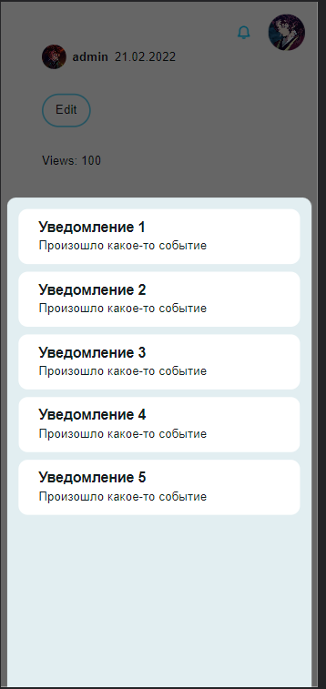
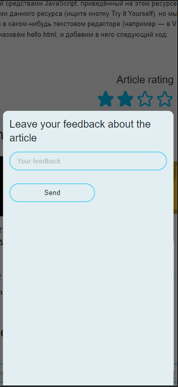

# Поддержка мобильных девайсов

В проекте стилизации не уделялось большого кол-ва внимания, т. к. он был направлен больше на 
технические вещи, поэтому верстка не адаптировалась для мобильных устройств. 

Однако кое-что для мобильных устройств все же было сделано - кастомный компонент **Drawer** (*shared/ui/redesigned/drawer*). 
**Drawer** представляет собой выплывающую снизу шторку, которая закрывается свайпом вниз. Для управления жестами были использованы библиотеки [React Sptring](https://react-spring.dev/) и [@use-gesture](https://use-gesture.netlify.app/docs/gestures/).

**Drawer** используется в двух местах: для показа списка уведомлений и для показа формы обратной связи, когда пользователь хочет оставить отзыв о статье. На десктопах при этом показываются модальные окна.

Как и компонент **Modal**, **Drawer** сделан с помощью **React.createPortal()**, который позволяет рендерить элементы в другой части DOM, чтобы стили родительских компонентов (oveflow: hidden) и прочее не влияло на их отображение.

### Drawer в уведомлениях

### Drawer в форме обратной связи
