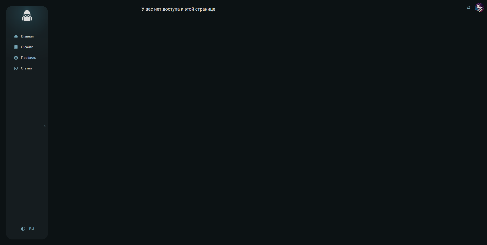

# Роутинг

Объект роутов расположен в **src/app/providers/router/config**.

Пример энтри объекта:

``` js
  [AppRoutes.ADMIN_PANEL]: {
    path: RoutePath.admin_panel,
    element: <AdminPanelPage />,
    authOnly: true,
    roles: [UserRole.MANAGER, UserRole.ADMIN],
  }
```

Проверка прав пользователя производится с помощью компонента **RequireAuth**, который находится тут же, но в папке **ui**. Компонент проверяет авторизован ли пользователь, и, если авторизован, имеет ли он требуемые для доступа к определенной странице роли.

Код компонента:

``` js
const RequireAuth = (props: RequireAuthProps) => {
  const {
    children,
    roles,
  } = props;

  const isAuth = useSelector(getUserAuthData);
  const userRoles = useSelector(getUserRoles);

  const hasRequiredRoles = useMemo(() => {
    if (!roles) {
      return true;
    }

    return userRoles?.some((role) => roles.includes(role));
  }, [roles, userRoles]);

  const location = useLocation();

  if (!isAuth) {
    return <Navigate to={RoutePath.main} state={{ from: location }} replace />;
  }

  if (!hasRequiredRoles) {
    return <Navigate to={RoutePath.forbidden} state={{ from: location }} replace />;
  }

  return children;
};
```

Пример использования:

``` js
<Route
  key={route.path}
  path={route.path}
  element={
    route.authOnly ? (
      <RequireAuth roles={route.roles}>
        {element}
      </RequireAuth>
    ) : element}  
  />    
```

При попытке зайти на страницу, которая не требует обязательной авторизации, но требует определенных ролей, которых нет у пользователя, пользователь будет перенаправлен на **ForbiddenPage**.


При попытке посетить несуществующий роут, пользователь будет перенаправлен на **NotFoundPage**. 
