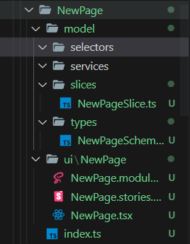
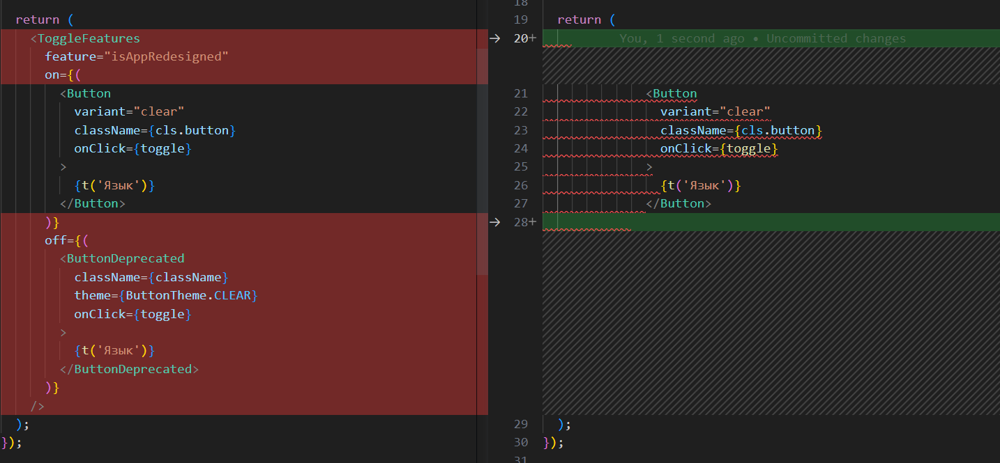

# Вспомогательные скрипты

В проекте написано 2 вспомогательных скрипта, они хранятся в */scripts*:

## createSlice

Cкрипт для создания структуры папок для новой сущности/фичи/страницы. 

Первым аргументом после названия скрипта указывается название слоя, в котором необходимо создать новую структуру папок, а вторым - название этой структуры.

Пример вызова скрипта:
```
npm run generate:slice pages NewPage
```
Результат:


## remove-feature 

Cкрипт для удаления ненужной фичи - старой, если новая успешно прошла тестирование, или новой - если она тестирования не прошла, и от нее решили отказаться

Первым аргументом после названия скрипта указывается название фичи, вторым - ее состояние, котрое необходимо оставить - **on** или **off**.

Пример вызова скрипта с флагом **on**:
```
npm run remove-feature isAppRedesigned on
```

Результат:
