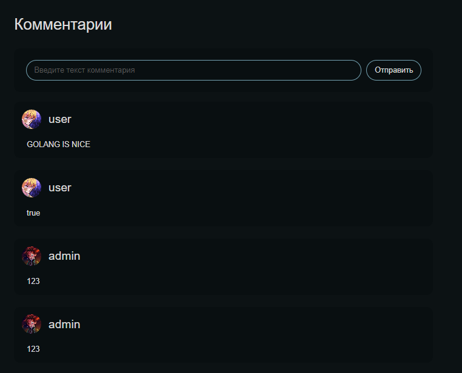
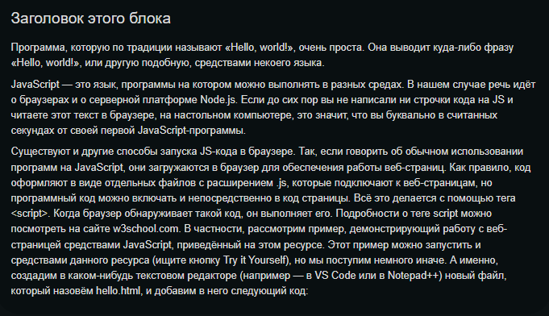
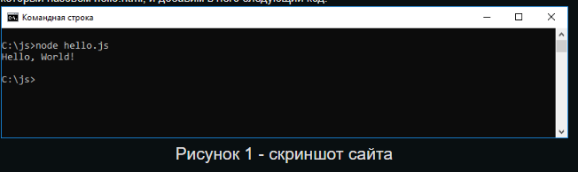

# Страница одной статьи 

На этой странице выводятся:
* контент статьи

* блок с рейтингом статьи

* форма для отправки комментария и список комментариев


## Контент статьи

По своей структуре статья состоит из 3-х видов блоков: 
### Блок с текстом

Этот блок состоит из названия и параграфов. Его реализация выглядит так:

``` js
const TextBlock = ({ block, className }: TextBlockProps) => {
  const { title, paragraphs } = block;

  return (
    <div className={className}>
      {title && (
        <ToggleFeatures
          feature='isAppRedesigned'
          on={<Text title={title} className={cls.title} />}
          off={<TextDeprecated title={title} className={cls.title} />}
        />
      )}
      {paragraphs.map((paragraph) => (
        <ToggleFeatures
          key={paragraph}
          feature='isAppRedesigned'
          on={(
            <Text
              className={cls.paragraph}
              key={paragraph}
              text={paragraph}
            />
          )}
          off={(
            <TextDeprecated
              className={cls.paragraph}
              key={paragraph}
              text={paragraph}
            />
          )}
        />
      ))}
    </div>
  );
};
```

Пример в статье:


### Блок с кодом
В этом блоке отображаются примеры кода, приведенные в статье. 

Реализация:
``` js
const CodeBlock = ({ block, className }: CodeBlockProps) => {
  const { code } = block;

  return (
    <div className={className}>
      <div style={{ margin: '20px 0' }}>
        <Code text={code} />
      </div>
    </div>
  );
};
```
Пример того, как выглядит компонент **Code**, можно найти в [Storybook][storybook-link] (redesigned).

### Блок с изображением
Данный блок предназначен для отрисовки изображений, содержащихся в статье.
Содержит в себе само изображение и его тайтл (если он есть).

Реализация:
``` js
const ImageBlock = ({ block, className }: ImageBlockProps) => {
  const { title, src } = block;

  return (
    <div className={className}>
      <AppImage className={cls.img} src={src} alt="" />
      {title && (
        <ToggleFeatures
          feature='isAppRedesigned'
          on={<Text title={title} className={cls.title} />}
          off={<TextDeprecated title={title} className={cls.title} />}
        />
      )}
    </div>
  );
};
```
Пример в статье:


Подробнее о работе с изображениями в проекте можно прочитать [здесь](/common/images/).

[storybook-link]: https://fatredsquirrel.github.io/production-project/
