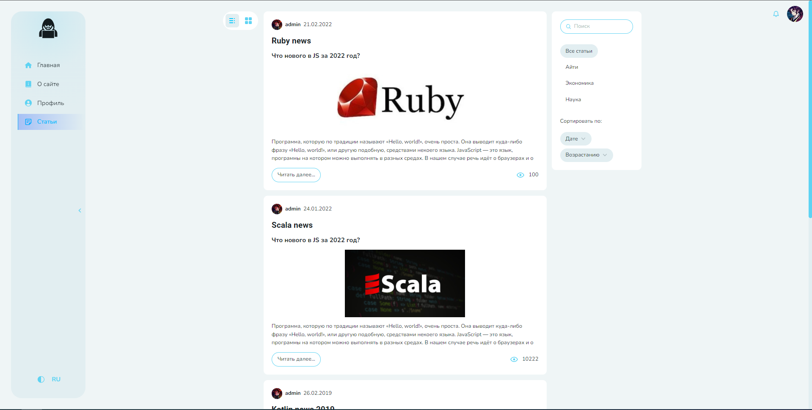

# Страница статей

На этой странице расположены (слева направо) блок с кнопками переключения вида, список статей и блок с фильтрами и видами сортировки.



## Виртуализация

В старом дизайне список статей **виртуальный**, реализован с помощью библиотеки [React Virtuoso](https://virtuoso.dev/). Список статей в проекте небольшой, библиотека была использована исключительно с целью изучить концепцию виртуализации списков, понять ее предназначение, принципы работы и получить опыт по ее использованию.
Механизм бесконечного скролла списка статей реализован в старом дизайне также с помощью возможностей этой библиотеки.

В новом дизайне ради дополнительной практики бесконечный скролл реализован "руками", поэтому данная библиотека там не использовалась. Подробнее о реализации бесконечного скролла ниже на этой странице.

## Фильтры и сортировка

Изменение параметров фильтров и сортировки изменяет текущий url, который потом можно скопировать и вставить на другой странице - все фильтры и соритровка применятся.

Например, выбрав статьи по теме "Айти" и отсортировов их по убыванию названия, получим следуюшую ссылку: [отсоритрованные статьи](https://frolicking-treacle-5b669c.netlify.app/articles?sort=title&order=desc&search=&type=IT)

::: warning
Для доступа к списку статей сначала необходимо [авторизоваться](/common/auth/)
:::

## Бесконечный скролл
  
В приложении реализован свой **механизм бесконечного скролла**. Каждая страница обернута в кастомный компонент **Page**, у которого есть пропс **onScrollEnd**. В этот пропс передается коллбэк, который вызывается, когда страница доскроллится до **триггер блока**, который находится в самом ее низу. 

Наблюдение за тем, находится ли триггер во view, реализовано с помощью **Intersections Observer**. 
Логика описана в хуке **useInfiniteScroll**, который находится в *shared/lib/hooks*.

Код хука:
``` js
export default function useInfiniteScroll(props: UseInfiniteScrollOptions) {
  const {
    callback,
    triggerRef,
    wrapperRef,
  } = props;

  const observer = useRef<IntersectionObserver | null>(null);

  useEffect(() => {
    const wrapperElement = wrapperRef?.current || null;
    const triggerElement = triggerRef.current;

    if (callback) {
      const options = {
        root: wrapperElement,
        rootMargin: '0px',
        threshold: 1.0,
      };

      observer.current = new IntersectionObserver(([entry]) => {
        if (entry.isIntersecting) {
          callback();
        }
      }, options);

      observer.current.observe(triggerElement);
    }

    return () => {
      if (observer.current && triggerElement) {
        // eslint-disable-next-line react-hooks/exhaustive-deps
        observer.current.unobserve(triggerElement);
      }
    };
  }, [callback, triggerRef, wrapperRef]);
}
```

## Сохранение скролла

Также реализован **механизм сохранения скролла** на странице. Если пользователь пролистает список статей до определенной статьи, откроет ее, а затем вернется обратно к списку статей, он окажется на том месте, до которого доскроллил перед тем как решил почитать статью.

Так выглядит обработчик скролла на странице:
``` js
  const handleScroll = useThrottle((e: UIEvent<HTMLDivElement>) => {
    dispatch(pageActions.setScrollPosition({
      path: location.pathname,
      position: e.currentTarget.scrollTop,
    }));
  }, 500);
```
Он сохраняет значение **scrollTop** в редакс для страницы, на котрой происходит событие. 

При открытии страницы сохраненное значение, если оно есть, достается, и странице присваивается скролл:
``` js
  useInitialEffect(() => {
    containerRef.current.scrollTop = scrollPosition;

    if (noInitialScroll) {
      window.scrollTo(0, 0);
    }
  }, []);
```

Также у страницы есть пропс **noInitialScroll**. Добавил его для того, чтобы страница одной статьи всегда открывалась сверху, статьи по размеру не большие. В реальном проекте можно было бы подумать над предоставлением пользователю опции вернуться туда, где остановил чтение.