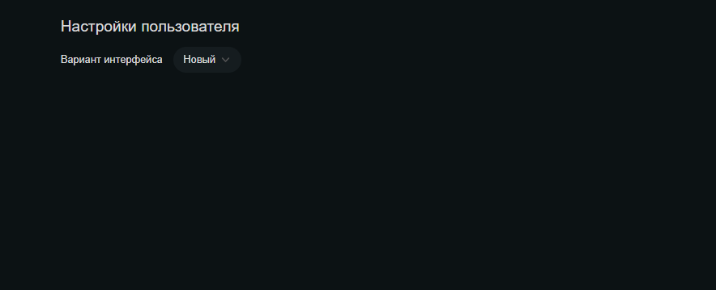

# Страница настроек

Находится по адресу */settings*. Перейти можно по ссылке из меню, которое выпадает при нажатии на аватар пользователя в шапке сайта.

Страница настроек пользователя на данный момент содержит лишь один селект - селект выбора варианта дизайна: нового или старого

При изменении значения улетает запрос на сервер, в котором передается соответствующее значение фичи **isAppRedesigned**, и дизайн система для текущего пользователя изменяется.